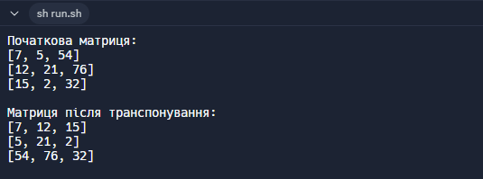

# Практична робота "Поглиблене використання масивів"

Цей репозиторій містить виконання практичної роботи з теми.

## 📌 Опис завдання

Реалізовано програму, яка транспонує (замінює рядки на стовпці) матрицю розміром `N x M`.  
Завдання виконано **без використання циклів** — з використанням API класу `Arrays`.  
Програма складається з двох класів:
- `MatrixUtils` — містить логіку для обробки матриці
- `MatrixUtilsTest` — тестує працездатність методу `transpose(...)`

---

### Метод:
``java
public static int[][] transpose(int[][] matrix)
``

----

## 🖼️ Скриншот виконання (приклад роботи)

